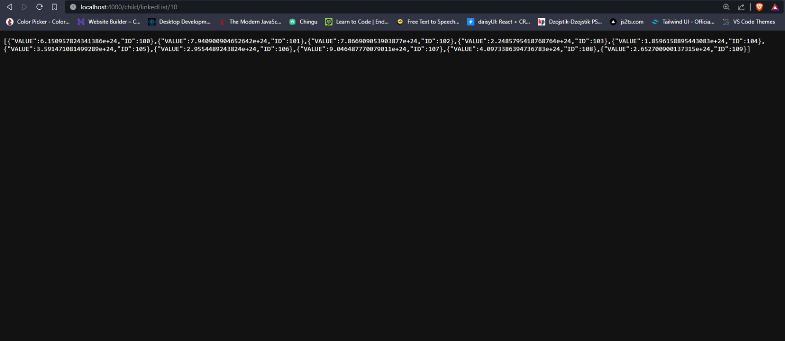

<a name="readme-top"></a>

<br />
<div align="center">
  <a href="https://github.com/TheGoldenCloud/Processes-app">
    
  </a>

<h3 align="center">Offloading main process</h3>

  <p align="center">
    ·
    <a href="https://github.com/TheGoldenCloud/Processes-app/issues">Report Bug</a>
    ·
    <a href="https://github.com/TheGoldenCloud/Processes-app/issues">Request Feature</a>
  </p>
</div>


<!-- TABLE OF CONTENTS -->
<details>
  <summary>Table of Contents</summary>
  <ol>
    <li>
      <a href="#about-the-project">About The Project</a>
      <ul>
        <li><a href="#built-with">Built With</a></li>
      </ul>
    </li>
    <li>
      <a href="#getting-started">Getting Started</a>
      <ul>
        <li><a href="#prerequisites">Prerequisites</a></li>
        <li><a href="#installation">Installation</a></li>
      </ul>
    </li>
  </ol>
</details>


<!-- ABOUT THE PROJECT -->
## About The Project

<!-- [![Product Name Screen Shot][product-screenshot]](https://example.com) -->

<!--  -->


This application is showing that the main process can't be blocked, providing ways to delegate requests to it's newly created threads and sub processes. For showcasing that functionality in this application you can generate/calculate n nodes in LinkedList based on user input. 

<p align="right">(<a href="#readme-top">back to top</a>)</p>


### Built With

[](https://skillicons.dev)
[](https://skillicons.dev)

<p align="right">(<a href="#readme-top">back to top</a>)</p>

## Getting Started

Simple and easy, just follow steps below

### Prerequisites

This is an example of how to list things you need to use the software and how to install them.
* npm
  ```sh
  npm install npm@latest -g
  ```

### Installation

1. Clone the repo
   ```sh
   git clone https://github.com/TheGoldenCloud/Processes-app.git
   ```
2. Get into app file
   ```sh
   cd Processes
   ```
3. Install NPM packages
   ```sh
   npm install
   ```
4. Start server
   ```sh
   npm start

<p align="right">(<a href="#readme-top">back to top</a>)</p>
